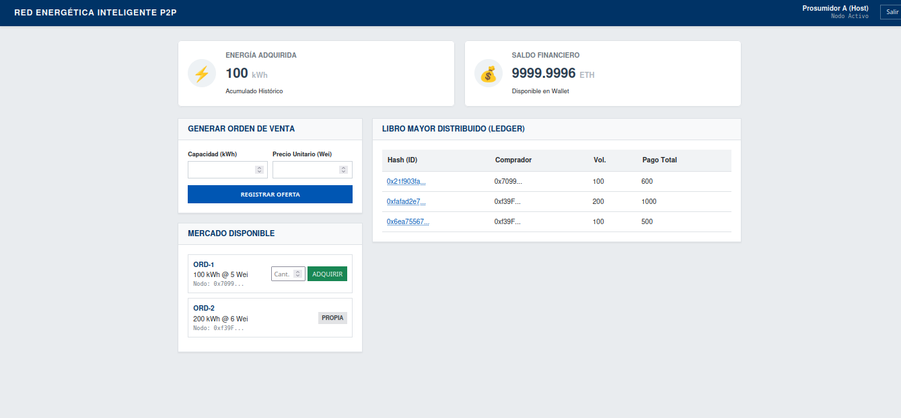
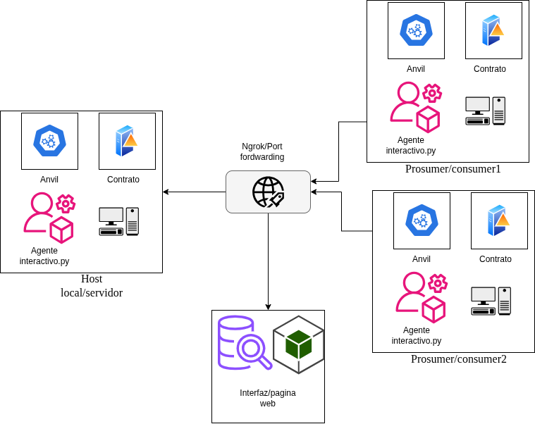

# Plataforma de Comercio de Energía P2P con Arquitectura DAO

Este proyecto implementa un prototipo funcional de un mercado energético descentralizado (Peer-to-Peer) sobre Blockchain. Utiliza un modelo de gobernanza DAO donde el **Operador del Sistema de Distribución (DSO)** recibe automáticamente una tarifa de red (`gridFee`) por cada transacción liquidada en el contrato inteligente.



## Características Principales

* **Arquitectura Descentralizada:** Lógica de negocio ejecutada 100% On-Chain (EVM).
* **Modelo DAO/DSO:** Integración financiera de la capa física mediante tarifas de red automatizadas.
* **Gestión de Identidad Simulada:** Sistema de Login mapeado a llaves privadas de Ethereum.
* **Auditoría Transparente:** Libro mayor (Ledger) público con desglose de pagos en tiempo real.
* **Interfaz Profesional:** DApp desarrollada en React para una experiencia de usuario fluida.

## Stack Tecnológico

* **Blockchain:** Foundry (Anvil & Forge) - Solidity v0.8.13.
* **Frontend:** React + Vite.
* **Web3 Integration:** Ethers.js v6.
* **Conectividad Remota:** Túneles RPC (Pinggy/Ngrok) para simulación WAN.

## Arquitectura del Sistema

El sistema separa la lógica financiera (On-Chain) de la interfaz de usuario (Off-Chain), conectadas mediante túneles seguros.



## Guía de Instalación y Ejecución

Sigue estos pasos para levantar el entorno de simulación local o remoto.

### Prerrequisitos
* Node.js v20+
* Foundry (Forge & Anvil)
* Git

### 1. Iniciar la Blockchain (Terminal 1)
```bash
# Inicia el nodo local permitiendo conexiones externas (CORS)
anvil --host 0.0.0.0 --allow-origin '*'

# Exporta la llave privada del Admin (Cuenta 0 de Anvil)
export PRIVATE_KEY=0xac0974bec39a17e36ba4a6b4d238ff944bacb478cbed5efcae784d7bf4f2ff80

# Despliega el contrato con los parámetros del DSO y Tarifa (3%)
forge script script/Deploy.s.sol --rpc-url [http://127.0.0.1:8545](http://127.0.0.1:8545) --broadcast

### 2. Desplegar el Contrato (Terminal 2)
# Exporta la llave privada del Admin (Cuenta 0 de Anvil)
export PRIVATE_KEY=0xac0974bec39a17e36ba4a6b4d238ff944bacb478cbed5efcae784d7bf4f2ff80

# Despliega el contrato con los parámetros del DSO y Tarifa (3%)
forge script script/Deploy.s.sol --rpc-url [http://127.0.0.1:8545](http://127.0.0.1:8545) --broadcast
#Nota: Copia la Contract Address resultante para el siguiente paso.
### 3. Configurar el Frontend

#Edita el archivo interfaz-mercado/src/constants.js:
export const CONTRACT_ADDRESS = "PEGAR_DIRECCION_AQUI";
export const RPC_URL = "[http://127.0.0.1:8545](http://127.0.0.1:8545)"; // O tu URL de túnel si es remoto

### 4. Iniciar la Interfaz Web (Terminal 3)

Bash

cd interfaz-mercado
npm install
npm run dev